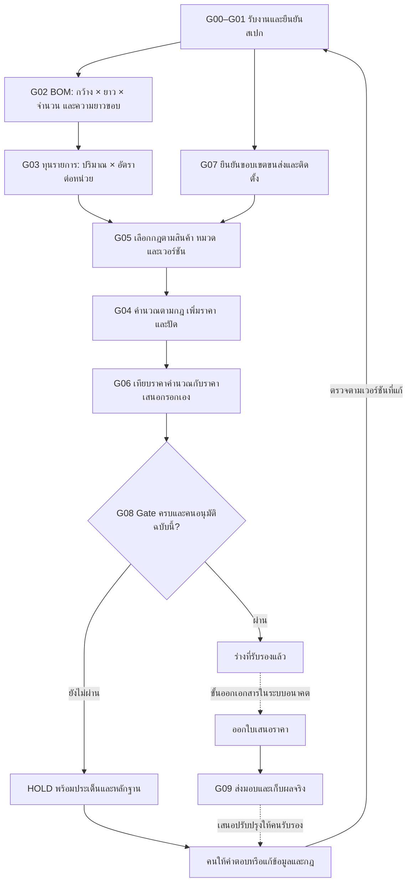
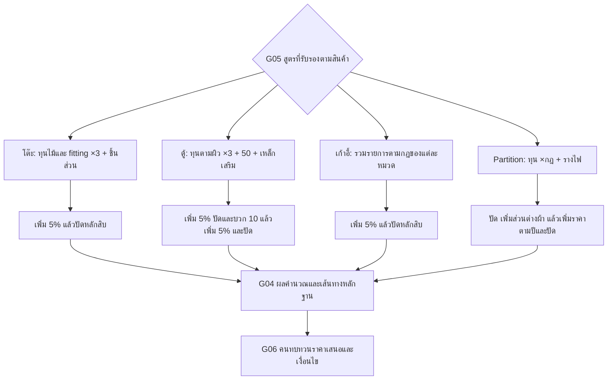

# Workflow งานประมาณราคา: สูตรคำนวณ + AI Agent + Human Gate

แบบเสนอออกแบบจากผลวิเคราะห์เฉพาะ 5 ไฟล์ที่ส่งมา เพื่อถ่ายทอดงานก่อนผู้ประมาณราคาเกษียณ เพิ่มสูตรและตัวอย่างตัวเลขลงใน Flow เดิม โดยแยกสูตรที่พบในไฟล์ออกจากคำตัดสินใจที่ต้องรับรองก่อนใช้กับงานจริง บทบาทผู้รับรองในตารางเป็นข้อเสนอ ยังต้องกำหนดผู้มีอำนาจจริงของบริษัท

ตัวเลขด้านล่างเป็นผลตามข้อมูลเดิมในไฟล์ ไม่ใช่ราคาซื้อใหม่หรือราคาที่รับรองแล้ว กฎที่พบ 22 รายการยังเป็น Observed จนกว่าคนรับรองขอบเขตและเวอร์ชันของกฎ

## Workflow หลัก



ลูกศรไปขั้นถัดไปหมายถึง Gate ที่เกี่ยวข้องผ่านแล้ว ถ้าพบข้อค้างในขั้นใดให้ HOLD ที่ขั้นนั้นพร้อมหลักฐาน กรณีแก้สเปก จำนวน BOM ราคา กฎ หรือขอบเขตงาน ต้องตรวจ Gate ที่ได้รับผลกระทบและรับรองฉบับใหม่

ขอบเขตขนส่ง/ติดตั้งจาก QCC เป็นข้อมูลก่อนคิดราคา ส่วนผลตรวจจริงและต้นทุนจริงอยู่หลังส่งมอบ จึงวาง G07 เป็นงานคู่ขนานกับ BOM/ราคา และวาง G09 หลังออกเอกสาร

## ตำแหน่งสูตรใน Workflow

| ขั้น | ข้อมูลเข้า | สูตร/การทำงาน | ข้อมูลออกและจุดที่คนต้องรับรอง |
|---|---|---|---|
| G00–G01 | ไฟล์ แบบ รุ่น ผิว จำนวน หน่วย และปีราคา | เลือกเอกสารและสเปก ไม่มีสูตรราคา | ชุดข้อมูลของงานที่ตรงกัน เก้าอี้ต้องแก้ความขัดแย้งรุ่น/ผิว/80 หรือ 160 ชุดก่อน |
| G02 | ขนาด จำนวนชิ้น ด้านปิดขอบ และรายการใช้/ไม่ใช้ | พื้นที่ = กว้าง × ยาว × จำนวน; ขอบ = (กว้าง × จำนวนด้านกว้าง + ยาว × จำนวนด้านยาว) × จำนวน; เผื่อเฉพาะรายการตามกฎ | BOM พร้อมหน่วยและปริมาณ คนรับรองช่องว่าง ค่าเผื่อ และข้อจำกัดการตัด |
| G03 | BOM และหลักฐานราคา | อัตราต่อหน่วย = ราคาแผ่น ÷ ฐานพื้นที่แผ่น หรือราคาเส้น ÷ ความยาวเส้น; ทุนรายการ = ปริมาณ × อัตรา | รายการพร้อมแหล่งราคา คนรับรองหน่วย ฐาน Net/VAT อายุราคา MOQ และ LT |
| G07 | QCC และข้อมูลหน้างาน | ระบุรวม/แยก/ไม่เกี่ยวข้อง/รอยืนยัน พร้อมผู้รับผิดชอบ; ไฟล์ QCC ไม่มีสูตรต้นทุน | ขอบเขตแพ็ก ขนส่ง ติดตั้ง รื้อถอน และป้องกันสินค้าให้เจ้าของงานรับรอง |
| G05 | สินค้า หมวดรายการ และเวอร์ชัน | เลือกกฎ ×3, ×2, ÷0.52, ข้อยกเว้น และลำดับเพิ่มราคาให้ตรงรายการ | กฎที่รับรองแล้วสำหรับงานฉบับนี้ ก่อนนำมาคำนวณ |
| G04 | BOM ราคา ขอบเขต และกฎที่เลือก | คำนวณตาม 4 เส้นทางด้านล่าง ตรวจการอ้างอิงและปัดตรงตำแหน่งในไฟล์ | ราคาคำนวณพร้อมเส้นทางถึงเซลล์ต้นทาง ข้อผิดพลาด/ข้อมูลสำคัญว่างให้ HOLD |
| G06 | ราคาคำนวณและราคาเสนอกรอกเอง | ผลต่างตัวเลข = ราคาเสนอ − ราคาคำนวณ หลังตรวจว่าฐานภาษี/ขอบเขตตรงกัน | คนรับรองเหตุผลปรับราคา VAT เครดิต ขอบเขต และอายุข้อเสนอ |
| G08 | Gate และประเด็นที่เกี่ยวข้องทั้งหมด | ตรวจครบ ตรงเวอร์ชัน ผู้รับรองมีอำนาจ และคำรับรองยังใช้ได้ | คนอนุมัติเอกสารฉบับนี้ การออกเอกสารเป็นขั้นอนาคต |
| G09 | ผลตรวจ QCC และต้นทุนจริงหลังส่งมอบ | เก็บปัญหาและข้อมูลจริง เสนอแก้ BOM/ราคา/กฎพร้อมหลักฐาน | คนรับรองการเปลี่ยนกฎก่อนใช้กับงานถัดไป |

ลำดับเลข Gate เป็นรหัสอ้างอิง: G05 เลือกและรับรองกฎก่อน G04 คำนวณ; G07 เริ่มคู่ขนานตั้งแต่รับงาน ไม่รอคำนวณเสร็จ

## สูตรร่วมของ BOM และอัตราราคา

| สูตรที่พบ | ตัวอย่างจากต้นฉบับ | ผลเดิม | จุดตัดสินใจของคน |
|---|---|---:|---|
| พื้นที่ = กว้าง × ยาว × จำนวน | โต๊ะ `252341-2-11!F6 = C6*D6*E6 = 0.6*1.5*1` | 0.90 ตร.ม. | แบบ หน่วย และขนาดสุทธิตรงงานหรือไม่ |
| ปริมาณหลังเผื่อ = ปริมาณสุทธิ × (1 + อัตราเผื่อ) | โต๊ะ `F5 = C5*1.1`; `C5 = SUM(F6:F8)` | 0.99 ตร.ม. | 10% ใช้กับวัสดุ/กระบวนการนี้หรือไม่; ไม่เผื่อซ้ำเมื่อปริมาณรวมค่าเผื่อแล้ว |
| ขอบ = (กว้าง × ด้านกว้าง + ยาว × ด้านยาว) × จำนวน | โต๊ะ `L6 = ((C6*J6)+(D6*K6))*E6 = (0.6*2+1.5*2)*1` | 4.20 เมตร | ด้านใดปิดขอบ ชนิดและความหนาอะไร |
| ความยาวขอบหลังเผื่อ | โต๊ะ `L5 = J5*1.1`; `J5 = SUM(L6:L8)` | 4.62 เมตร | เผื่อขอบ 10% ตรงงานหรือไม่ |
| อัตราแผ่นเป็นบาท/ตร.ม. = ราคาแผ่น ÷ ฐานพื้นที่ในไฟล์ | โต๊ะ `T6 = 1035/4.32` | 239.583333 บาท/ตร.ม. | ฐาน 4.32 ตรงขนาดและหน่วยซื้อจริงหรือไม่ |
| ทุนไม้ = ปริมาณหลังเผื่อ × อัตรา | โต๊ะ `U6 = R6*T6 = 0.99*(1035/4.32)` | 237.187500 บาท | ราคา/ผิว/อายุราคาที่ใช้อ้างอิง |
| ทุนขอบ = เมตรหลังเผื่อ × บาท/เมตร | โต๊ะ `U7 = 4.62*18` | 83.16 บาท | แหล่งราคาและชนิดขอบ |
| ทุน fitting = จำนวน × อัตรา | โต๊ะ `U8:U13 = R*T` ของแต่ละแถว | รวม 91.60 บาท | จำนวน หน่วยซื้อ และหน่วยใช้ |
| บาท/เมตรของเหล็ก = ราคาเส้น ÷ ความยาวเส้น | โต๊ะ `คาน 1.5x1.5!T6 = 564/6` | 94 บาท/เมตร | 6 เมตรเป็นฐานซื้อที่ตรงกับแหล่งราคาหรือไม่ |
| บาท/เมตรของอลูมิเนียม = กก./เมตร × บาท/กก. | Partition `Z5 = 0.6*163`; `AA5 = 0.44*163`; `AB5 = 0.22*163` | 97.80 / 71.72 / 35.86 | น้ำหนักในสูตรกับข้อความกำกับไม่ตรงกันบางจุด ต้องรับรองค่าที่ใช้ |

ขนาดในตัวอย่างถูกป้อนเป็นเมตรอยู่แล้ว ถ้าระบบอนาคตรับแบบหน่วยมิลลิเมตร ให้เพิ่มขั้นแปลงหน่วยและการตรวจหน่วยที่ G01–G02 โดยรับรองก่อนใช้ ไม่เปลี่ยนตัวเลขในสูตรต้นฉบับโดยคาดเดา

ค่าเผื่อในไฟล์ต่างกันตามรายการ: โต๊ะไม้/ขอบ 10%, ตู้ ML1 15% และ ML2/ขาว 10%, เหล็กรางไฟ Partition 5% ค่าเผื่อวัตถุดิบ 5% กับ UP ราคาปลายทาง 5% เป็นคนละขั้น

## แยกเส้นทางสูตรที่ G05–G04



ใช้ `ROUND(x,-1)` ตาม Excel ซึ่งปัดเป็นหลักสิบที่ใกล้ที่สุด เช่น 3,523.846 → 3,520 ไม่ได้หมายถึงปัดขึ้นทุกครั้ง ตู้มี `+10` แยกหลัง ROUND ส่วนสินค้าอื่นไม่ได้มีกฎนี้

### 1. โต๊ะ Studio-A Fastl

ไฟล์ `โต๊ะ Studio-A Fastl Model(1).xlsx` ชีตหลัก `252341-2-11`

| ลำดับ | สูตรในไฟล์/สูตรขยาย | ผลเดิม (บาท) |
|---|---|---:|
| รวมทุนไม้ ขอบ และ fitting | `U14 = SUM(U6:U13) = 237.1875+83.16+91.60` | 411.947500 |
| ใช้ตัวคูณกับกลุ่มนี้ | `U15 = U14*3` | 1,235.842500 |
| อื่น ๆ | `U16 = R16*T16 = 1*50` | 50 |
| ขา 2 ขา | `U17 = 2*'ขา Studio-A-L600'!U27 = 2*1130` | 2,260 |
| คาน 1.5 เมตร | `U18 = 1.5*'คาน 1.5x1.5'!U11 = 1.5*390` | 585 |
| FLIPTOP ขาว 1 ชุด | `U19 = 1*FLIPTOP!AE17 = 1*1250` | 1,250 |
| รวม | `U20 = SUM(U15:U19)` | 5,380.842500 |
| UP 5% | `U21 = U20*1.05` | 5,649.884625 |
| ปัด | `U22 = ROUND(U21,-1)` | **5,650** |
| ผลที่ชีตระบุรวม VAT 7% | `U23 = U22*1.07` | **6,045.50** |
| ราคาเสนอกรอกเอง | `U25 = 9300` ไม่มีสูตรเชื่อม U22/U23 | **9,300** |

สูตรสรุปตามเส้นทางเดิม:

```text
ราคาคำนวณโต๊ะ
= ROUND((411.9475*3 + 50 + 2*1130 + 1.5*390 + 1250)*1.05,-1)
= 5650
ผลรวม VAT ที่มีสูตรในชีต = 5650*1.07 = 6045.50
ราคาเสนอกรอกเอง = 9300
```

ราคาของขา คาน และ FLIPTOP ผ่านสูตรภายในชีตย่อยแล้ว จึงบวกตามจำนวนที่ชีตหลักกำหนด ไม่ใช้ ×3 ซ้ำกับทุกส่วนของโต๊ะ

สูตรประกอบสำคัญ:

| ชิ้นส่วน | สูตรในชีตย่อย | ผลและ Gate |
|---|---|---|
| ขา | `U25 = U7+U9+U11+U13+U15+U18+U24`; วัตถุดิบ `U7/U9/U11/U13/U15` = ทุนแต่ละชนิด ×3; สี `U18 = (U16+U17)*4`; งานผลิต/fitting `U24 = SUM(U19:U23)*3`; `U27 = ROUND(U26,-1)` | 1,126.202000625 → **1,130/ขา**; G02 ตรวจ E8:E9 ว่าง G05 รับรองตัวคูณ |
| คาน | `ROUND((1*1.1*(564/6))*3 + (1*20)*4,-1)` ที่ `คาน 1.5x1.5!U11` | 390.20 → **390/เมตร**; G03–G05 รับรองฐานเส้น ค่าเผื่อ สี และตัวคูณ |
| FLIPTOP ขาว | `AE15 = SUM(AE11:AE14) = 197.20078125+50+700+300`; `AE16 = AE15`; `AE17 = ROUND(AE16,-1)` | 1,247.20078125 → **1,250**; G05 รับรองเหตุผลที่ขาวไม่มี ×1.05 ใน AE16 |
| FLIPTOP ML1/ML2 | `U16 = U15*1.05`; `Z16 = Z15*1.05`; ปัดที่ U17/Z17 | **1,340 / 1,310**; ใช้เฉพาะผิวที่รับรอง ห้ามเอาข้อยกเว้นขาวไปใช้กับทุกสี |

Human Gate: ยืนยัน Studio-U ในคำบรรยายชีตหลักกับชีตขา Studio-A; B5 และ FLIPTOP ที่ใช้เป็น MLขาว แต่ T3 ระบุ ML2 ต้องเลือกผิวให้ตรงงาน; E8:E9 ของขาว่างทั้งที่มีขนาด ห้ามเติม 1 เอง; รับรองความหมายของ ×3/×4 และอื่น ๆ 50; ยืนยันฐาน VAT/ขอบเขตของราคาเสนอ 9,300

### 2. ตู้ MW-7002: แยก ML1 / ML2 / MLขาว

ไฟล์ `ตู้ MW-7002 W.900XD.400XH.730 MM. ML1,ML2,MLขาว(1).xlsx` ชีตหลัก `260700-01-01,02,09`

ให้ `C` เป็นผลรวมทุนแถว 5:28 ของผิวที่เลือก ใช้ข้อมูลตามคอลัมน์ U / Z / AE โดยคงความละเอียดต้นฉบับก่อนปัด:

```text
รวมก่อน UP = C*3 + 50 + 0.9*390
ปัดรอบแรก = ROUND(รวมก่อน UP*1.05,-1) + 10
ราคาคอลัมน์ยืน 31/12/2026 = ROUND(ปัดรอบแรก*1.05,-1)
ราคาเสนอ = ค่าที่กรอกเองในแถว 38
```

| ขั้น/เซลล์ | ML1: U | ML2: Z | MLขาว: AE |
|---|---:|---:|---:|
| ค่าเผื่อวัตถุดิบตามผิว | 15% | 10% | 10% |
| ทุนแถว29 = SUM(แถว5:28) | 1,560.533568090278 | 1,264.076118680556 | 1,108.441016041667 |
| แถว30 = ทุน ×3 | 4,681.600704270833 | 3,792.228356041668 | 3,325.323048125000 |
| แถว31 + แถว32 = 50 + 0.9×390 | 401 | 401 | 401 |
| แถว33 = SUM(แถว30:32) | 5,082.600704270833 | 4,193.228356041668 | 3,726.323048125000 |
| แถว34 = แถว33 ×1.05 | 5,336.730739484376 | 4,402.889773843752 | 3,912.639200531250 |
| แถว35 = ROUND(แถว34,-1)+10 | **5,350** | **4,410** | **3,920** |
| แถว36 = ROUND(แถว35×1.05,-1) | **5,620** | **4,630** | **4,120** |
| แถว38 ราคาเสนอกรอกเอง | **9,100** | **7,450** | **6,600** |

อัตราไม้ตัวอย่างตามผิวในแถว5: ML1 `T5 = 1374/4.32`, ML2 `Y5 = 712/2.88`, ขาว `AD5 = 797/4.32` ฐานราคาและพื้นที่แผ่นต่างกัน จึงเลือกด้วยผิว/ความหนา/แหล่งหลักฐาน ไม่ใช้ราคาเดียวกับทุกผิว

ชีตย่อย `เหล็กเสริมชั้นปรับ W.1000` คำนวณต่างหาก:

```text
L16 = ROUND(ทุนเหล็ก*3 + ค่าสี*4 + (ค่าพับ+ค่าเจาะ+อื่น)*3,-1)
    = ROUND(29.833680555556*3 + 7.3*4 + (10+12+10)*3,-1)
    = 210
```

ชีตหลักใช้อัตรา 390 บาท/เมตรที่ T32/Y32/AD32 แบบกรอกเอง ไม่ได้อ้าง L16=210 ต้องให้คนยืนยันหน่วยและความสัมพันธ์ก่อนใช้แทนกัน

Human Gate: รับรอง +10 และ UP 5% สองชั้น; เลือกคอลัมน์ราคาผู้ขายให้ชัด; ภาพราคา Metro ระบุยืนถึง 30/09/2026 จึงต้องยืนยันหลักฐานที่ใช้หลังวันนั้น; ยืนยัน VAT ของราคาคำนวณและราคาเสนอ เพราะช่วงราคาหลักไม่มีสูตร VAT เหมือนโต๊ะ

### 3. เก้าอี้ NUVO: คำนวณตามหมวดรายการ

ไฟล์ `เก้าอี้ NUVO-NV-10,08  หุ้มหนังเทียม  80 ชุด อิงราคากล(1).xlsx` ตัวอย่างชีตหลัก `260047-11-1` ซึ่งในชีตระบุ NV-09 3 ที่นั่ง + PLATE หุ้มผ้า และ I30 ระบุ 160 ชุด ต้องรับรองสเปกจริงก่อนใช้ราคา

```text
F_i = จำนวน C_i * อัตรา E_i
H_i = F_i                 สำหรับคาน/แผ่นรองนั่ง/PLATE ที่คิดราคาจากชีตย่อยแล้ว
H_i = F_i*2               สำหรับรายการซื้อที่ชีตนี้กำหนด
H24 = F24/0.52            สำหรับค่าแรงหุ้ม
H25 = SUM(H4:H24)
H26 = H25*1.05
H27 = ROUND(H26,-1)
```

| รายการและเซลล์ H | สูตรขยาย | ผลที่เข้าสู่ยอดรวม (บาท) |
|---|---|---:|
| คาน H4 | `1*1680` จาก `คานยาว 2230 มม.!U13` | 1,680 |
| ขา H5 | `2*(510+100)*2` | 2,440 |
| ฝาปิด H6 | `2*(70+20)*2` | 360 |
| GD H7 | `4*105*2` | 840 |
| แผ่นรองนั่ง H8 | `4*220` จาก `แผ่นรองนั่ง!U14` | 880 |
| PLATE H9 | `1*410` จาก `PLATE!U12` | 410 |
| อุปกรณ์ย่อย H10:H18 และ H20:H22 | รวมผลของแต่ละรายการหลัง ×2 ตามสูตร | 313.76 |
| โฟม H19 | `3*980*2` | 5,880 |
| ผ้า H23 | `(1.2*3)*250*2` โดย C23 ใช้หน่วย YD | 1,800 |
| แรงหุ้ม H24 | `3*100/0.52` | 576.923076923077 |
| รวม H25 | `SUM(H4:H24)` | **15,180.683076923078** |
| UP H26 | `H25*1.05` | 15,939.717230769233 |
| ปัด H27 | `ROUND(H26,-1)` | **15,940** |
| เสนอ H30 | กรอกเอง | **21,600** |
| ราคาจากบัญชี H32 | กรอกเอง | **20,900** |

คานราคา 1,680 มีสูตรภายในแล้ว: `ROUND(402.700833333333*3 + 111.5*4 + 10*3,-1) = 1680` ไม่คูณ ×2 ซ้ำใน H4

Human Gate: รับรองรุ่น ผ้า/หนังเทียม จำนวนชุด และจำนวนที่นั่ง; E19 ใช้โฟม 980 แต่มีภาพใบราคา Register260047 ที่ระบุ 840 พร้อมเงื่อนไขจำนวน ต้องเลือกราคาที่ตรงงาน; อธิบาย +100/+20 ของขา/ฝาปิด ตัวคูณ ×2 และฐาน 0.52; ราคาเสนอและบัญชีเป็นคนละค่ากรอกเอง ต้องให้ผู้มีอำนาจเลือก

สูตรเก่าในชีตซ่อนต้องแยกเวอร์ชัน: `NV-06!H5 = F5*1.53*1.15/0.52` และ `190325-12-16 NV-07 20 ตัว!H5 = F5*1.57*1.15/0.52` ไม่ยกมาแทน ×2 ของชีตหลักโดยอัตโนมัติ ชีตซ่อน NV-09/NV-11 มี #REF! ต้อง HOLD เมื่อเลือกเส้นทางเหล่านั้น

### 4. Partition: BOM → รางไฟ → ส่วนต่างผ้า → ราคาตามปี

ไฟล์ `Partition(1).xlsx` ชีต `P2-PW1240D-หุ้มผ้า 1912` ตัวอย่างแถว8 รุ่น PW1260D

ให้ `q_j` เป็นปริมาณคอลัมน์ Z:AU ของแถวสินค้า และ `r_j` เป็นอัตราของคอลัมน์เดียวกันในแถว5 สูตรเขียนย่อเพื่ออ่านง่ายดังนี้:

```text
J8 = Σ(q_j*r_j)              เทียบเท่าผลบวก Z$5*Z8 ถึง AU$5*AU8 ในต้นฉบับ
K8 = J8*3
L8 = 'รางไฟยาว 600'!U15*2
M8 = ROUND(K8+L8,-1)
N6 = 350-278 = 72
N8 = AK8*N6
O8 = N8/0.52
P8 = M8+O8
Q8 = ROUND(P8,-1)
R8 = ROUND(Q8*1.05,-1)        คอลัมน์ยืน66
S8 = ROUND(R8*1.05,-1)        คอลัมน์ยืน67
T8 = ROUND(S8*1.05,-1)        คอลัมน์ยืน68
U8 = ROUND(T8*1.05,-1)        คอลัมน์ยืน69
```

| ลำดับ | ตัวเลขแทนในสูตร | ผลเดิม (บาท) |
|---|---|---:|
| ทุน J8 | รวมปริมาณ × อัตราตามวัสดุ | 990.244866666667 |
| K8 | `J8*3` | 2,970.734600 |
| ราง L8 | `180*2` | 360 |
| ปัด M8 | `ROUND(2970.7346+360,-1)` | 3,330 |
| ส่วนต่างผ้า N8 | `1.4*(350-278)` | 100.80 |
| แปลงส่วนต่าง O8 | `100.8/0.52` | 193.846153846154 |
| รวม P8 | `3330+193.846153846154` | 3,523.846153846154 |
| ปัด Q8 | `ROUND(P8,-1)` | **3,520** |
| ยืน66 R8 | `ROUND(3520*1.05,-1)` | **3,700** |
| ยืน67 S8 | `ROUND(3700*1.05,-1)` | **3,890** |
| ยืน68 T8 | `ROUND(3890*1.05,-1)` | **4,080** |
| ยืน69 U8 | `ROUND(4080*1.05,-1)` | **4,280** |

ต้องเก็บการปัดทุกปีตามต้นฉบับ ไม่รวมขั้นเป็นการคูณ 1.05 ยกกำลังแล้วปัดครั้งเดียว ตัวอย่างแถว13: `Q13=5170 → R13=5430 → S13=5700 → T13=5990` แต่ `ROUND(5170*1.05^3,-1)=5980` ต่างกัน 10 บาท ปริมาณโครงไม้ที่อ้างจากคอลัมน์ F ของชีตโครงรวมค่าเผื่อแล้ว และชีตหลักไม่ได้ใช้ราคาของโครงทั้งชุด

รางไฟ 400 มม. เป็นตัวอย่างสูตรย่อยที่ผ่านตัวคูณแล้ว:

```text
ทุนเหล็ก = 0.1*0.4*1*1.05*(2450/2.88) = 35.729166666667
ค่าสี = (0.1*0.4*1)*2*20 = 1.6
ค่าพับ = 4*1 = 4
รางต่อชิ้น = ROUND(ทุนเหล็ก*3 + ค่าสี*3 + ค่าพับ*3,-1) = 120
ราง2ระดับในแถว7 = 120*2 = 240
```

ชีตราง `U14 = U13` ไม่ได้เพิ่มราคา 5% และ U15 ปัดจาก U13 ค่าสีใช้ ×3 ต่างจากสีงานเหล็กโต๊ะที่ใช้ ×4 ต้องรับรองกฎตามตระกูลสินค้า ไม่คูณราง ×3 ซ้ำที่ชีตหลัก

ข้อยกเว้นที่ต้อง HOLD/รับรอง:

| จุดในชีตหลัก | สิ่งที่พบ | คนต้องตัดสินใจ |
|---|---|---|
| K7:K15 เทียบ K16:K17 | แถว7:15 ใช้ `J*3`; แถวซ่อน16:17 ใช้ `J*2.22*1.15/0.52` | ขอบเขตใช้กฎสองชุดและเหตุผล ไม่อนุมานตามขนาดเอง |
| ราคาปี69 | U8/U16/U17 มีผล **4,280 / 12,540 / 13,220**; อีก 8 แถว U7,U9:U15 ว่าง | ปีที่ใช้และฐานรุ่นที่ไม่มีราคา69 ห้ามหยิบ T ปี68 มาเป็น69 |
| N6 เทียบ AK5 | ส่วนต่างผ้า `350-278=72` แต่ฐานราคาผ้า AK5=250 | ที่มาของ 278/350 และหน่วย; ใช้คนละบทบาทกับราคาผ้าพื้นฐาน |
| O14 ว่าง | N14 มี 187.20 แต่ P14 บวก O14 ที่ว่างจึงไม่รับส่วนต่างผ้า | ข้อยกเว้นหรือตกหล่น ห้ามเติมสูตรเอง |
| N13 / N14 | `N13 = AK13*N7`; `N14 = AK15*N6` | รับรองการอ้างแถว; ค่าปัจจุบันที่เท่ากันอาจซ่อนการอ้างผิด |
| J19/J20 | สูตรทางเลือก `ROUND(11100/1.2*ความกว้าง,-1)` ได้ **12,030 / 12,950** | ต้นทางฐาน 11,100 และเงื่อนไขที่ใช้สูตรสัดส่วนแทน BOM |
| Y8 | `(M8-X8)*100/M8 = (3330-4110)*100/3330 = -23.423423%` | ฐานเปรียบเทียบ M กับราคากลาง X; ไม่เรียกค่านี้ว่ากำไร |
| N4 | LT120วัน / ยืน30วัน / ขั้นต่ำสีละ80เมตร | วันเริ่มอายุราคา ปริมาณต่อสี และกำหนดส่งจริง |

### 5. QCC และค่าใช้จ่ายหน้างาน

ไฟล์ `Check list QCC แยกแผนกฝ่ายจัดส่ง 2569(1).xlsx` ไม่มีสูตรคำนวณราคา ไม่มีอัตราค่าขนส่ง/ติดตั้ง และไม่มีต้นทุนจริง

เชื่อม `Sheet1!M32:M38` กับความครบสินค้า/อุปกรณ์/แพ็ก/การจัดรถ/พื้นที่/ป้องกันสินค้ารับกลับ และ `M50:M53` กับเอกสาร/สำรวจหน้างาน/จุดวิกฤต/ส่งข้อมูลกลับ รวมข้อกำหนดในภาพเป็น G07 ก่อนคำนวณ และ G09 หลังส่งมอบ

แต่ละรายการต้องมีคำตอบว่ารวมในราคา แยกคิด ไม่เกี่ยวข้อง หรือรอยืนยัน พร้อมหลักฐาน ผู้รับผิดชอบ และการครอบคลุมในกฎ ห้ามตั้งค่าขนส่ง/ติดตั้งเป็น 0 หรือถือว่าอยู่ใน “อื่น ๆ 50”/ตัวคูณ ×3 โดยไม่มีคำรับรอง

## G06: สะพานจากราคาคำนวณไปสู่ราคาเสนอ

ค่าผลต่างต่อไปนี้เป็นการลบตัวเลขที่พบ เพื่อระบุคำถาม ไม่ใช่กำไร เพราะยังไม่ได้รับรองต้นทุนทั้งหมด ฐาน VAT และขอบเขตที่เทียบกัน

| งาน/ผิว | ฐานคำนวณที่เลือกแสดง | ราคาเสนอกรอกเอง | ผลต่างตัวเลข | เซลล์ |
|---|---:|---:|---:|---|
| โต๊ะ | 5,650 | 9,300 | 3,650 | U22 → U25; U23 รวม VAT =6,045.50 ต้องเลือกฐานให้ชัด |
| ตู้ ML1 | 5,620 | 9,100 | 3,680 | U36 → U38 |
| ตู้ ML2 | 4,630 | 7,450 | 2,820 | Z36 → Z38 |
| ตู้ขาว | 4,120 | 6,600 | 2,480 | AE36 → AE38 |
| เก้าอี้ตัวอย่าง | 15,940 | 21,600 | 5,660 | H27 → H30; H32 ราคาบัญชี=20,900 |

คนต้องอธิบายการปรับราคาและเลือกฐาน VAT/ขอบเขต/เครดิต/อายุข้อเสนอให้ตรงกันก่อนเทียบ ระบบอนาคตจึงบันทึกเส้นทางจากราคาคำนวณไปยังราคาที่อนุมัติได้ ไม่อนุมานเปอร์เซ็นต์จากค่ากรอกเองให้เป็นกฎบริษัท

## สูตรกับ Human Gate: จุดที่ AI ต้องหยุด

| Gate | ตรวจสูตรและข้อมูลอะไร | เงื่อนไข HOLD ที่มาจากไฟล์ |
|---|---|---|
| G01 | รุ่น ผิว ขนาด จำนวน หน่วย และปีราคา | เก้าอี้ชื่อไฟล์/ข้อความในชีตขัดกัน; รหัส Partition ซ้ำต่างขนาด ต้องเลือก variant ให้ชัด |
| G02 | Quantity, applicability, ค่าเผื่อ และหน่วย | E8:E9 ของขาโต๊ะว่าง; ปริมาณโครง/ขอบอาจผ่านค่าเผื่อแล้ว ห้ามคิดซ้ำ |
| G03 | แหล่งราคา หน่วย Net/VAT จำนวนเฉพาะล็อต MOQ อายุราคา และ LT | โฟม980เทียบภาพ840; ราคา Metro หมดช่วงยืนที่ระบุ; วันเริ่มยืน30วันไม่ชัด |
| G05 | ขอบเขตตัวคูณและสถานะราคาของรายการ | ×3/×4/×2/÷0.52 ที่มารอรับรอง; ขาว FLIPTOP ยกเว้น5%; Partition กฎแถวซ่อนต่างกัน |
| G04 | การอ้างอิง เส้นทางสูตร ค่าว่าง และตำแหน่งปัด | #REF! ในเส้นทางที่เลือก; O14 ว่าง; N13/N14 อ้างแถวต่าง; ราคา69ไม่ครบ |
| G06 | ความสัมพันธ์ราคาคำนวณกับราคากรอกเอง | เหตุผลปรับราคา ฐานภาษี หรือขอบเขตยังไม่รับรอง |
| G07 | ค่าใช้จ่ายหน้างานและ cost coverage | ไม่มีหลักฐานว่าค่าขนส่ง/ติดตั้งอยู่ใน ×3 หรืออื่น50; พื้นที่/วิธีปฏิบัติยังไม่ยืนยัน |
| G08 | คำรับรองของข้อมูลและกฎฉบับเดียวกัน | ประเด็นค้าง ผู้รับรองไม่มีอำนาจ คำรับรองหมดอายุหรือคนละเวอร์ชัน |

AI แสดงผล replay ตามไฟล์เดิมหรือกรณีทดลองได้ขณะ HOLD โดยติดป้ายให้ชัด แต่ผลคำนวณผ่านไม่ได้ปิด Human Gate และไม่ได้รับรองกฎราคา

## ทะเบียนกฎ 22 รายการที่เชื่อมเข้า Flow

| กฎ | เนื้อหาสูตร/การทำงานที่พบ | Gate เจ้าของขั้น |
|---|---|---|
| R01 | พื้นที่ = กว้าง×ยาว×จำนวน | G02 |
| R02 | ขอบ = (กว้าง×ด้านกว้าง + ยาว×ด้านยาว)×จำนวน | G02 |
| R03 | แปลงราคาแผ่น/เส้น/kgเป็นอัตราต่อหน่วยที่ใช้ | G03 |
| R04 | ค่าเผื่อวัตถุดิบ 5%/10%/15% ตามรายการ | G02 + G05 |
| R05 | โต๊ะ: ทุนกลุ่มไม้×3 + อื่น50 + ขา + คาน + FLIPTOP | G04–G05 |
| R06 | งานเหล็กโต๊ะ: วัตถุดิบ×3 สี×4 งานผลิต/fitting×3 | G04–G05 |
| R07 | โต๊ะ UP5% → ROUND(-1) → สูตร VAT7% | G04–G06 |
| R08 | FLIPTOP ขาวไม่มี UP5% ที่ชีตย่อย แต่ ML1/ML2 มี | G05 |
| R09 | ตู้ตามผิว: ทุน×3 +50 +0.9×390 → UP5% → ROUND(-1)+10 | G04–G05 |
| R10 | ตู้: เพิ่ม5%อีกชั้นและปัดสำหรับราคายืน31/12/2026 | G04–G05 |
| R11 | เหล็กเสริมตู้ชีตย่อย: วัตถุดิบ×3 สี×4 งานผลิต×3 →210 | G03–G05 |
| R12 | เก้าอี้: บวกตรง/×2/÷0.52 แยกตามหมวด | G04–G05 |
| R13 | เก้าอี้: SUM(H4:H24) →UP5% →ROUND(-1) | G04–G05 |
| R14 | เก้าอี้ชีตเก่า: ×1.53หรือ1.57 ×1.15 ÷0.52 | G00 + G05 |
| R15 | Partition: รวมปริมาณZ:AU ×อัตราแถว5 | G02–G04 |
| R16 | Partition: ×3 หรือ×2.22×1.15÷0.52 + ราง2ระดับ →ปัด | G04–G05 |
| R17 | Partition: AK×(350−278)÷0.52 →บวกMและปัด; ตรวจข้อยกเว้นO14 | G04–G05 |
| R18 | Partition: เพิ่ม5%และปัดต่อปี66→67→68→69 | G04–G05 |
| R19 | Partition: สูตรสัดส่วน11100÷1.2×กว้าง →ปัด | G05 |
| R20 | รางไฟ: วัตถุดิบ×3 สี×3 พับ×3 →ปัด ไม่มีUP5%ในชีตย่อย | G04–G05 |
| R21 | ราคาเสนอกรอกเอง ต้องมีเหตุผลและผู้รับรอง | G06 + G08 |
| R22 | QCC: เงื่อนไขขอบเขต/ส่งมอบ ไม่มีสูตรราคา | G07 + G09 |

## ข้อมูลที่ต้องส่งต่อแต่ละขั้นสำหรับ AI Agent

เป็นโครงข้อมูลที่เสนอสำหรับระบบอนาคตเพื่อรองรับการย้อนสูตรและ Gate:

```text
งานและสเปกที่รับรอง (G00–G01)
  -> BOM: รายการ ปริมาณสุทธิ/หลังเผื่อ หน่วย applicability เซลล์ต้นทาง (G02)
  -> Rate: ราคาและหน่วยซื้อ อัตราต่อหน่วย หลักฐานผู้ขาย อายุ/เงื่อนไข (G03)
  -> Scope: รวม/แยก/ไม่เกี่ยวข้อง/รอยืนยัน และผู้รับผิดชอบ (G07)
  -> Rule: สินค้า/variant หมวด price_stage ตัวคูณ ปัด เวอร์ชัน/วันมีผล (G05)
  -> Calculation: สูตร Input -> Intermediate -> Output และข้อค้าง (G04)
  -> Commercial: ราคาที่เสนอ VAT ขอบเขต เครดิต อายุ เหตุผลปรับ (G06)
  -> Approval: ผู้มีอำนาจ หลักฐาน คำรับรองฉบับเดียวกัน (G08)
  -> Delivery feedback: QCC ผลงานจริงและข้อเสนอแก้กฎ (G09)
```

`price_stage` ต้องบอกว่ารายการเป็นทุน อัตรางานผลิต ราคาชิ้นส่วนที่คิดแล้ว หรือราคาเสนอ เพื่อป้องกันการใช้ตัวคูณซ้ำ ทุกคำรับรองผูกกับชุดข้อมูลและเวอร์ชันกฎ หากสิ่งเหล่านี้เปลี่ยนต้องตรวจ Gate ที่ได้รับผลกระทบอีกครั้ง

## งานของ AI และคำตัดสินใจของคน

| Gate | งาน AI | เรื่องที่คนรับรอง | บทบาทที่เสนอ |
|---|---|---|---|
| G00 | อ่านทุกชีต รวมชีตซ่อน สูตร ภาพ และตรึงเวอร์ชัน | เอกสารและชีตใดใช้จริง/เป็นประวัติ | เจ้าของกระบวนการประมาณราคา |
| G01 | เทียบรุ่น รหัส ขนาด ผิว จำนวน หน่วย และแบบ | สเปกและงานที่ใช้คำนวณจริง | ฝ่ายขาย + ประมาณราคา + วิศวกรรม |
| G02 | ถอด BOM ปริมาณ ค่าเผื่อ และรายการที่ว่าง | ใช้/ไม่ใช้รายการใด จำนวนและหน่วยถูกต้องหรือไม่ | วิศวกรรม/ผลิต + ประมาณราคา |
| G03 | เทียบหลักฐานราคา อายุราคา MOQ หน่วย จำนวนเฉพาะล็อต และ LT | เลือกแหล่งราคาและเงื่อนไขที่ตรงงาน | จัดซื้อ + ประมาณราคา |
| G07 | เชื่อม QCC กับขอบเขตบรรจุ ขนส่ง ติดตั้ง และหน้างาน | รวมในราคา แยกคิด ไม่เกี่ยวข้อง หรือยังต้องสำรวจ | ประสานโครงการ + จัดส่ง/ติดตั้ง + QC |
| G04–G05 | เลือกกฎที่รับรอง คำนวณด้วย engine และตรวจเส้นทางสูตร | ตัวคูณ ลำดับการคิด ข้อยกเว้น การปัด และหมวดค่าใช้จ่ายที่ครอบคลุม | เจ้าของสูตร + หัวหน้าประมาณราคา + ผู้รับรองนโยบายราคา |
| G06 | แสดงสะพานจากราคาคำนวณไปยังราคาเสนอ | ราคาเสนอ เหตุผลปรับราคา VAT ขอบเขต เครดิต และอายุข้อเสนอ | ประมาณราคา + ฝ่ายขาย + ผู้มีอำนาจราคา |
| G08 | ตรวจ Gate/ประเด็นที่จำเป็น อายุคำรับรอง และเอกสารฉบับเดียวกัน | อนุมัติราคาและเงื่อนไขของเวอร์ชันนี้ | ผู้อนุมัติที่บริษัทแต่งตั้ง |
| G09 | เก็บ QCC ผลส่งมอบ ปัญหา และต้นทุนจริงเมื่อมี | การแก้งาน เปลี่ยนขอบเขต และข้อเสนอปรับกฎ | จัดส่ง/ติดตั้ง + ประสานโครงการ + QC |

G04–G05 อยู่ในช่วงคำนวณเดียวกัน: รับรอง/เลือกกฎก่อนใช้ คำนวณ แล้วตรวจเส้นทางและผล ไม่เลือกตัวคูณหลังได้ราคาเสร็จแล้ว

## กระบวนการ Gate ที่ใช้ทุกขั้น

1. ตรวจข้อมูล หน่วย ความสัมพันธ์ และเงื่อนไขของขั้นนั้น
2. ถ้าขาด/ขัดแย้ง/หมดอายุ/ผิดเงื่อนไข ให้ HOLD พร้อมไฟล์–ชีต–เซลล์หรือภาพหลักฐาน
3. AI เสนอคำตอบและกรณีทดลองได้ โดยบันทึกเป็น PROPOSED ซึ่งไม่ปิด Gate
4. คนตัดสินใจโดยบันทึกคำตอบ เหตุผล หลักฐาน ผู้รับรอง วันที่ เวอร์ชัน และวันสิ้นอายุ
5. ถ้าคำตอบทำให้ต้องแก้ข้อมูล ให้คำนวณและตรวจฉบับใหม่ คำรับรองต้องตรงกับข้อมูลฉบับนั้น
6. รับรองบาง Gate ไม่ถือว่ารับรองทั้งงาน และ Gate ครบแต่ประเด็น/เงื่อนไขที่จำเป็นยังค้างต้องคง HOLD

## ตัวอย่างสิ่งที่ทำให้ HOLD จากไฟล์จริง

| จุด | หลักฐานและเรื่องที่ต้องตอบ |
|---|---|
| G01 | เก้าอี้: ชื่อไฟล์ NV-10/08 หนังเทียม 80 ชุด แต่ชีต 260047-11-1 ระบุ NV09 หุ้มผ้า และมีข้อความ 160 ชุด |
| G02 | ขาโต๊ะ: ขา Studio-A-L600!E8:E9 ว่าง ทั้งที่ C8:D9 มีขนาด ต้องยืนยันใช้/ไม่ใช้/ตกหล่น |
| G03 | เก้าอี้: E19 ใช้โฟม 980 บาท แต่ภาพใบราคา Register260047 มี 840 บาทพร้อมเงื่อนไขจำนวน |
| G03 | ตู้: ภาพราคา Metro ระบุยืนถึง 30/09/2026 ต้องมีหลักฐานใช้ราคาหลังวันดังกล่าว |
| G04–G05 | Partition: สูตรส่วนต่างผ้า O14 ว่าง ตัวคูณต่างกันตามแถว และราคาปี69 หลายแถวไม่ครบ |
| G06 | โต๊ะ: ราคาจากสูตร 5,650 บาท แต่เสนอกรอกเอง 9,300 บาท ต้องอธิบายฐาน VAT ขอบเขตและเหตุผล |
| G07 | QCC: ค่าใช้จ่ายและผู้รับผิดชอบขนส่ง/ติดตั้ง/ป้องกันสินค้า ยังไม่มีต้นทุนครบให้ตีเป็นศูนย์ |
| G08 | คำรับรองไม่ครบ หมดอายุ ผู้รับรองไม่มีอำนาจ หรือเป็นคนละเวอร์ชัน |

## ปัจจัยแวดล้อมที่ต้องเข้าสู่ Workflow

- G01–G02: รุ่น ขนาด ผิว จำนวน หน่วยซื้อ เกรด ชิ้นส่วน ค่าเผื่อและข้อจำกัดการตัด
- G03: ผู้ขาย อายุราคา ราคาเฉพาะล็อต MOQ ต่อสี LT หน่วย/แพ็กซื้อ VAT/Net เครดิต และเงื่อนไขส่งมอบ
- G04–G06: ราคาเป็นทุนหรือราคาชิ้นส่วนที่ผ่านตัวคูณแล้ว ค่าแรง/ตั้งเครื่อง cost coverage และอำนาจราคา
- G07–G09: บรรจุภัณฑ์ การขนขึ้นรถ อุปกรณ์ ทางเข้าหน้างาน ติดตั้ง/รื้อถอน การเปลี่ยนขอบเขต ผลคุณภาพและต้นทุนจริง

ปัจจัยทั้ง 20 รายการและหลักฐานอยู่ใน Blueprint เดิม ข้อมูลที่ยังไม่ทราบต้องระบุรอยืนยัน ไม่แทนด้วยต้นทุนศูนย์

## ขอบเขตต้นแบบที่สร้างแล้ว

ต้นแบบ CLI/API ที่ทดสอบแล้วใช้ replay สูตรเดิม แสดงข้อค้าง และเก็บคำเสนอ/คำรับรองตามเวอร์ชัน ยังไม่มี capability ส่งหรือ release ใบเสนอราคาเอง เส้นประจากร่างไปขั้นออกเอกสารแสดงส่วนที่จะพัฒนาในอนาคตหลังรับรองกฎและอำนาจบริษัท

G00–G08 เป็น Gate ก่อนเสนอราคา รวม 9 จุด G09 เป็น Gate หลังส่งมอบ จึงไม่ต้องรอผลส่งมอบจริงเพื่อเตรียมเสนอราคา

## แผนถ่ายทอดความรู้ก่อนเกษียณ

ใช้ทะเบียน 30 ประเด็นเป็นคำถามทีละข้อ ให้เจ้าของงานตอบจากหลักฐานจริง พร้อม worked example และ counterexample แล้วระบุขอบเขต ผู้เป็นเจ้าของ ผู้รับรอง และอายุของกฎ กฎที่พบ 22 รายการจะยกระดับเป็นกฎที่ใช้จริงได้เมื่อผ่านการรับรอง
